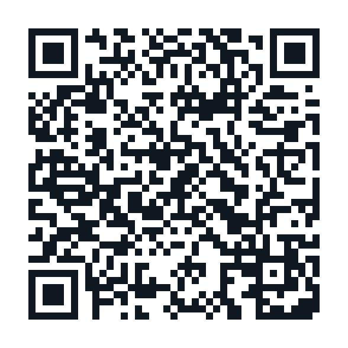

# Breath Trainer

A breath-hold training app for one goal: **a 2:00 hold (stretch: 3:00) by October 31**.
Runs entirely in the browser — no accounts, no server, your data stays on your device.

**Live:** https://terranaaron.github.io/breath-trainer/

### Scan to open on your phone

Point your phone camera at this code (or open [`qr.html`](qr.html) for a full-screen,
printable version). It opens the live app — then use Share → **Add to Home Screen**.

## Training modes

| Mode | What it is | When |
|---|---|---|
| **CO₂ Table** | 8 holds at a fixed length, rest shrinks each round (105s → 15s). Trains tolerance to CO₂ build-up — the "urge to breathe" is CO₂, not lack of oxygen. | 2–3× / week |
| **O₂ Table** | 8 holds that grow each round (40% → 80% of your best), rest fixed at 2:00. Trains comfort with longer holds. Targets auto-scale from your personal best. | 2–3× / week (alternate with CO₂ days) |
| **Max Test** | 2:00 of calm breathing, then one relaxed all-out hold. Sets/updates your baseline and shows real progress. | 1× / week |

The app suggests which session to do today, tracks weekly consistency
(target: 5 sessions/week), and charts your best hold against the 2:00 goal line.

## Use it on your iPhone

1. Open the live link in **Safari**
2. Tap **Share** → **Add to Home Screen**
3. It opens full-screen like a real app. Keep the sound on — the beeps let you
   train with your eyes closed.

## During a session

- **Tap anywhere on the big timer card** to release a hold (or use the Release button)
- Beep at target · milestone beeps every 30s on max tests · triple-beep when a rest ends
- The screen stays awake during a session (Wake Lock)

## Sharing it with other people

Just send them the link. History is stored **per device, per browser** — every
person's phone keeps its own private log, and nothing is ever uploaded anywhere.
On first run the app asks for a name, which is bound to that device's log: it shows
in the header, labels data exports (`breath-trainer-aaron.json`), and the app warns
if you try to import a file that belongs to someone else.

Two people sharing **one** device/browser would share one log — if that comes up,
use separate browsers (e.g., Safari vs. Chrome) or ask for a profiles feature.

## Your data

History lives in your browser's `localStorage` (per device). Use **Export data** /
**Import** on the Progress tab to back it up or move it between your own devices.
**Add the app to your home screen** — besides the app-like feel, iOS gives
home-screen web apps durable storage, while a plain Safari tab left unvisited for
a week can have its site data evicted.

## Safety — read this

- **Never practice breath-holds in or near water.** Dry land, sitting or lying down, only.
- **Never hyperventilate before a hold.** Fast deep breathing removes the CO₂ warning
  signal and can make you black out with no warning. Calm, normal breathing only.
- Stop immediately if you feel dizzy, tingly, or see spots.
- One table session per day — recovery is part of the training.
- If you have any cardiovascular or respiratory condition, or are pregnant, talk to a
  doctor before training breath-holds.
